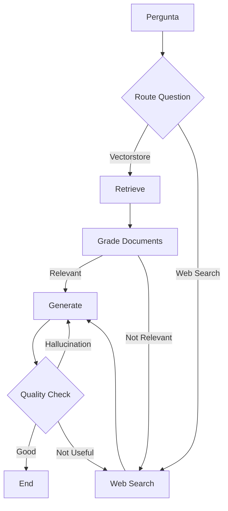

# LangGraph Studio - Guia de Uso

Este documento explica como configurar e usar o LangGraph Studio para visualizar e debugar o sistema RAG adaptativo.

## 🚀 Configuração Inicial

### 1. Instalar Dependências

```bash
# Instalar todas as dependências incluindo LangGraph Studio
pip install -r requirements.txt

# Ou usando uv (recomendado)
uv pip install -r requirements.txt
```

### 2. Configurar Variáveis de Ambiente

Certifique-se de que o arquivo `.env` está configurado com todas as variáveis necessárias:

```env
# Vertex AI Credentials
GOOGLE_APPLICATION_CREDENTIALS=vertex-ai-credentials.json
PROJECT_ID=your-project-id
LOCATION=us-central1
GOOGLE_LLM_MODEL=gemini-2.5-flash
GOOGLE_EMBEDDINGS_MODEL=gemini-embedding-001

# Web Search (Required)
TAVILY_API_KEY=your-tavily-api-key

# LangChain Tracing (Optional)
LANGCHAIN_API_KEY=your-langchain-api-key
LANGCHAIN_TRACING_V2=true
LANGCHAIN_ENDPOINT=https://api.smith.langchain.com
LANGCHAIN_PROJECT=agentic-rag
```

## 🎯 Iniciando o LangGraph Studio

### Método 1: Script Automatizado (Recomendado)

```bash
python start_studio.py
```

Este script:
- ✅ Verifica se todas as dependências estão instaladas
- ✅ Confirma se o arquivo `.env` existe
- ✅ Valida a configuração do `langgraph.json`
- 🚀 Inicia o LangGraph Studio automaticamente

### Método 2: Comando Direto

```bash
langgraph studio
```

O LangGraph Studio será aberto em: **http://localhost:8123**

## 📊 Usando o LangGraph Studio

### Interface Principal

1. **Graph View**: Visualização do fluxo do grafo RAG adaptativo
2. **Threads**: Histórico de execuções e conversas
3. **Playground**: Interface para testar o sistema interativamente

### Componentes do Grafo Visíveis

O Studio mostrará os seguintes nós do seu sistema RAG:

- **🔍 Route Question**: Roteamento inicial da pergunta
- **📚 Retrieve**: Busca no vectorstore
- **⚖️ Grade Documents**: Avaliação da relevância dos documentos
- **🌐 Web Search**: Busca na web quando necessário
- **✍️ Generate**: Geração da resposta
- **✅ Quality Check**: Verificação de alucinações e qualidade

### Fluxo de Execução



## 🧪 Testando o Sistema

### 1. Perguntas para Vectorstore

Teste com perguntas relacionadas aos documentos indexados:

```
"What are the key components of an AI agent?"
"How does planning work in AI agents?"
"What is the role of memory in AI systems?"
```

### 2. Perguntas para Web Search

Teste com perguntas que requerem informações atuais:

```
"What's the weather like today?"
"Latest news about AI developments"
"Current stock price of NVIDIA"
```

## 🔧 Debugging e Monitoramento

### Visualização de Estados

O Studio permite visualizar:
- **Estado inicial**: Pergunta do usuário
- **Estados intermediários**: Documentos recuperados, scores de relevância
- **Estado final**: Resposta gerada e validações

### Logs e Traces

- **Console Logs**: Mensagens de debug do sistema
- **Execution Traces**: Caminho completo da execução
- **Performance Metrics**: Tempo de execução de cada nó

### Modificação em Tempo Real

Você pode:
- 🔄 Reexecutar nós específicos
- 📝 Modificar estados intermediários
- 🎛️ Ajustar parâmetros de execução

## 📈 Métricas e Analytics

### Métricas Disponíveis

- **Routing Accuracy**: Precisão do roteamento de perguntas
- **Document Relevance**: Score médio de relevância dos documentos
- **Generation Quality**: Qualidade das respostas geradas
- **Execution Time**: Tempo total de processamento

### Integração com LangSmith

Se configurado, o Studio se integra com LangSmith para:
- 📊 Analytics avançados
- 🔍 Debugging distribuído
- 📝 Logging centralizado
- 🎯 A/B testing

## 🛠️ Configurações Avançadas

### Modificar Configuração do Grafo

Edite `langgraph.json` para ajustar:

```json
{
  "dependencies": ["."],
  "graphs": {
    "adaptive_rag": {
      "path": "src.core.workflow.graph:get_workflow",
      "description": "Adaptive RAG system that routes queries between vectorstore retrieval and web search",
      "config": {
        "max_iterations": 10,
        "timeout": 300
      }
    }
  },
  "env": ".env"
}
```

### Personalizar Interface

O Studio permite:
- 🎨 Temas personalizados
- 📐 Layout customizável
- 🔧 Shortcuts personalizados

## 🚨 Troubleshooting

### Problemas Comuns

1. **Studio não inicia**
   ```bash
   # Verificar instalação
   pip show langgraph-studio
   
   # Reinstalar se necessário
   pip install --upgrade langgraph-studio
   ```

2. **Grafo não carrega**
   - Verificar sintaxe do `langgraph.json`
   - Confirmar que o caminho para `get_workflow` está correto
   - Verificar imports no `graph.py`

3. **Variáveis de ambiente não carregam**
   - Confirmar que `.env` está no diretório raiz
   - Verificar sintaxe das variáveis
   - Reiniciar o Studio após mudanças

### Logs de Debug

Para habilitar logs detalhados:

```python
import logging
logging.basicConfig(level=logging.DEBUG)
```

## 🎯 Próximos Passos

1. **Experimentar com diferentes tipos de perguntas**
2. **Analisar métricas de performance**
3. **Otimizar prompts baseado nos insights do Studio**
4. **Configurar alertas para problemas de qualidade**
5. **Implementar testes automatizados baseados nos traces**

## 📞 Suporte

Para problemas específicos:
- 📖 [Documentação oficial do LangGraph Studio](https://langchain-ai.github.io/langgraph/tutorials/langgraph-studio/)
- 🐛 [Issues no GitHub](https://github.com/langchain-ai/langgraph/issues)
- 💬 [Comunidade LangChain](https://discord.gg/langchain)

---

**Dica**: Use o Studio regularmente durante o desenvolvimento para identificar gargalos e oportunidades de otimização no seu sistema RAG!
